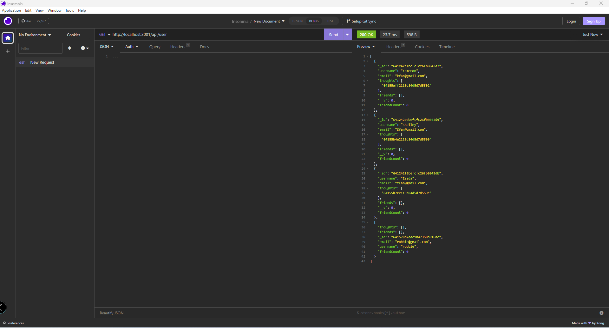
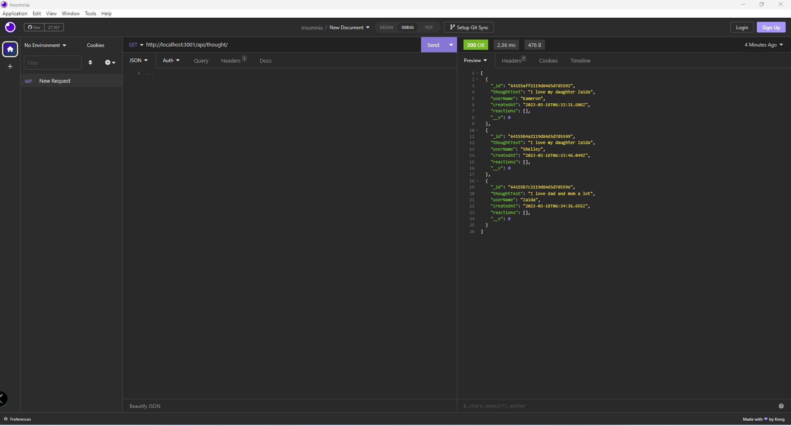

  # Social-Media-API

  ## License
  

  ## Description
  This project is a Social Media API server running with MongoDB and Express. You can make calls to the server through two routes. The first route is the User route and you can use it to find, update, create, and delete users. This route also handles friend requests and keeps count of the number of friends a user has. The second route is the thought route. It keeps track of the users post or in this case their thoughts you can do all of the same things on this route as the User route but for the thoughts. Instead of keeping track of the friend count it keeps track of the reactions count on the users thoughts.
  
   Please see the video below on how the server works with API calls. 
  
  [Click Here for Video of Social media API](https://drive.google.com/file/d/1-L53pBYE69VS1Nr6JP3hSgorYlAfLYn9/preview)

  ## Table of Contents
  - [License](#License)
  - [Description](#Description)
  - [Installation](#installation)
  - [Usage](#Usage)
  - [Credits](#credits)
  - [Tests](#Tests)
  - [Questions](#Questions)
  
  ## Installation
  - npm install express
  - npm install mongodb

  ## Usage
  
  
  
 
  
  ## Credits
  Section 20 Mini project and assignment 26 source code. 
  Help From TAs and Cornelius Davis and Gustavo Carillo

  ## Tests
  All routes, models, and controllers have been tested and proven to work. Please see the video above to show how they work. 

  ## Questions
  If you would like to ask me any questions. Contact me at my email address below or you can check out my Github profile.
  - Email - kfarshchian@gmail.com
  - Github user name - https://github.com/kfarshchian
  
  
